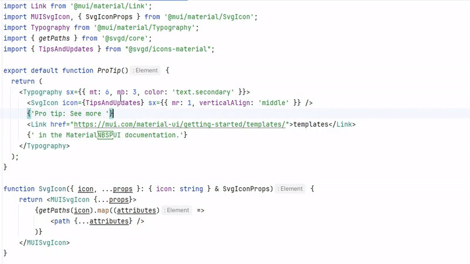
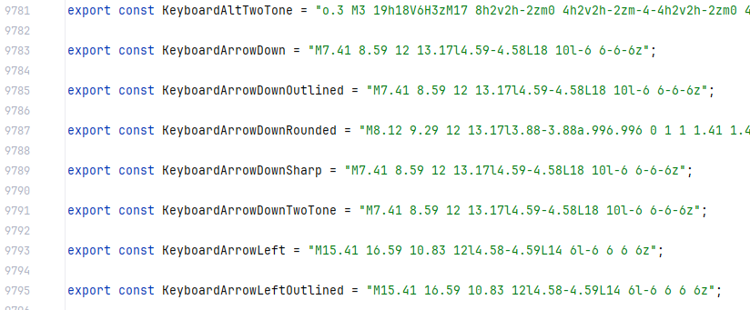
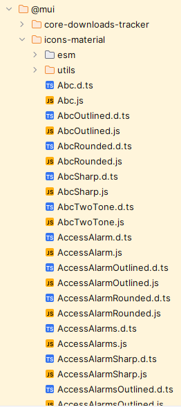
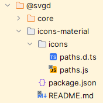

# @svgd/icons-material

[](https://www.npmjs.com/package/@svgd/icons-material)

A single-file collection of Material UI icon paths with IDE preview in the autocomplete.

The accompanying TypeScript declarations include base64‑encoded previews so supported editors show the icon image right inside tooltips.



## Installation
```bash
npm install @svgd/icons-material
# or
yarn add @svgd/icons-material
```

## Usage with React

Create Svg Component:

```tsx
import React from 'react';
import { getPaths } from '@svgd/core';
import MUISvgIcon, { SvgIconProps } from '@mui/material/SvgIcon';

export function SvgIcon({ icon, ...props }: { icon: string } & SvgIconProps) {
  return (
    <MUISvgIcon {...props}>
      {getPaths(icon).map((attrs, i) => (
        <path key={i} {...attrs} />
      ))}
    </MUISvgIcon>
  );
}
```

Then:

```tsx
import { Abc } from '@svgd/icons-material';

<SvgIcon icon={Abc} />;

```

or 

```tsx
import * as icons from '@svgd/icons-material';

<SvgIcon icon={icons.Abc}  />

```

## Usage with Vue 3

```html
<template>
  <SvgIcon :icon="icons.Abc" width="24" height="24" />
</template>

<script setup lang="ts">
import { h, defineComponent } from 'vue';
import { getPaths } from '@svgd/core';
import * as icons from '@svgd/icons-material';

const SvgIcon = defineComponent({
  props: {
    icon: { type: String, required: true },
    width: { type: [String, Number], default: 24 },
    height: { type: [String, Number], default: 24 },
  },
  setup(props) {
    return () =>
      h(
        'svg',
        {
          xmlns: 'http://www.w3.org/2000/svg',
          viewBox: '0 0 24 24',
          width: props.width,
          height: props.height,
        },
        getPaths(props.icon).map((attrs, i) => h('path', { key: i, ...attrs }))
      );
  },
});
</script>

```


## Usage with Angular

```ts
// svg-icon.component.ts
import { Component, Input } from '@angular/core';
import { getPaths } from '@svgd/core';

@Component({
  selector: 'svg-icon',
  template: `
    <svg viewBox="0 0 24 24" [attr.width]="size" [attr.height]="size">
      <path
        *ngFor="let attrs of paths"
        [attr.d]="attrs.d"
        [attr.fill]="attrs.fill"
        [attr.stroke]="attrs.stroke"
      />
    </svg>
  `,
})
export class SvgIconComponent {
  @Input() icon!: string;
  @Input() size: number | string = 24;
  get paths() {
    return getPaths(this.icon);
  }
}

```

Then in your module:

```ts
import { NgModule } from '@angular/core';
import { SvgIconComponent } from './svg-icon.component';

@NgModule({
    declarations: [SvgIconComponent],
    exports: [SvgIconComponent],
})
export class SvgIconModule {}

```

## Usage in Plain JavaScript (no framework)
```html
<!DOCTYPE html>
<html lang="en">
<head>
  <meta charset="UTF-8" />
  <title>SVGD Plain JS Example</title>
  <script type="module">
    import { getPaths } from '@svgd/core';
    import { Abc } from '@svgd/icons-material';

    document.addEventListener('DOMContentLoaded', () => {
      const svg = document.createElementNS('http://www.w3.org/2000/svg', 'svg');
      svg.setAttribute('viewBox', '0 0 24 24');
      svg.setAttribute('width', '64');
      svg.setAttribute('height', '64');

      getPaths(Abc).forEach((attrs) => {
        const path = document.createElementNS('http://www.w3.org/2000/svg', 'path');
        Object.entries(attrs).forEach(([key, value]) => {
          path.setAttribute(key, value);
        });
        svg.appendChild(path);
      });

      document.body.appendChild(svg);
    });
  </script>
</head>
<body>
</body>
</html>
```

## More info

This package exports paths.js with 10,773 icon path definitions.



All icons are bundled into one file to avoid the thousands of small modules in the original MUI icons packages.

 -> 

A static HTML preview is available on [GitHub Pages](https://simprl.github.io/svgd_mui/).
